# Deploy EverShop To Microsoft Azure

This document describes step by step how to deploy EverShop to Microsoft Azure using Azure App Service.

## Prerequisites:

1. An active Microsoft Azure account.
2. An EverShop project installed on your local machine.
3. Git installed (for version control if your app is in a Git repository).

## Step 1: Create a New Azure Web App

1. Log in to the Azure portal (https://portal.azure.com).
<p align="center">

  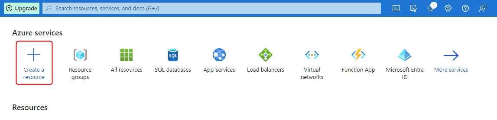
</p>
2. Click on the "+ Create a resource" button.
3. Search for "Web App & Database" and select "Web App & Database" from the results.
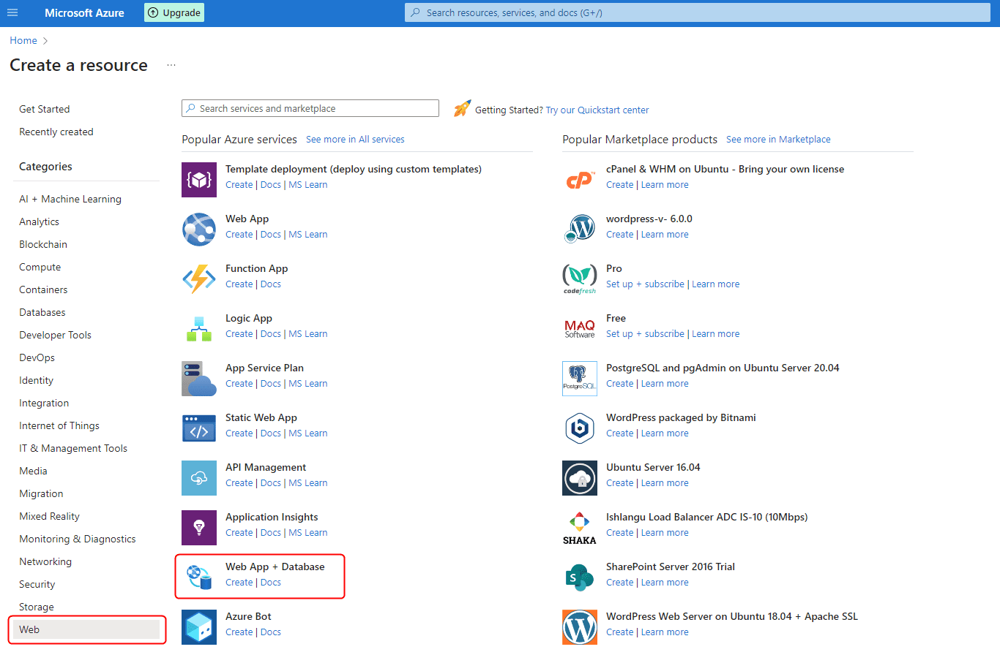
4. Click the "Create" button to start configuring your web app.
5. Fill out the necessary information, including the App name, subscription, resource group, OS (Linux or Windows), and other settings.

For the app, let's use the following settings:

<p align="center">

  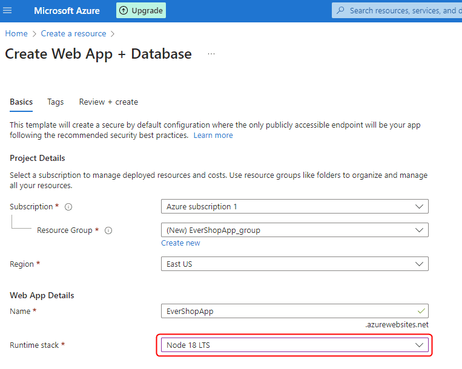
</p>

And for the database, let's use the following settings:

<p align="center">

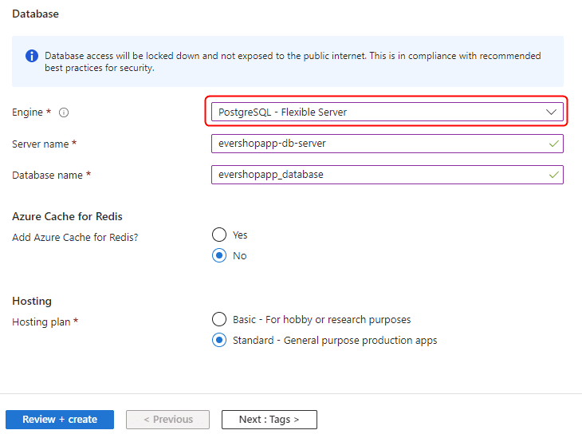
</p>

6. Click "Review + create" and then "Create" to create the web app. This is how it looks like when the web app is created:

<p align="center">

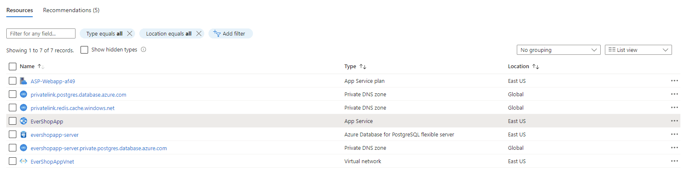
</p>

## Step 2: Configure Deployment Options

Azure supports several deployment options, including FTP, local Git, GitHub, Bitbucket, and Azure Repos. In this guide, we will use the local Git option.

1. Once the web app is created, go to the "Deployment Center" in the Azure portal.
2. Choose `local Git` as the deployment option.
3. Click the "Save" button to save the configuration.

<p align="center">

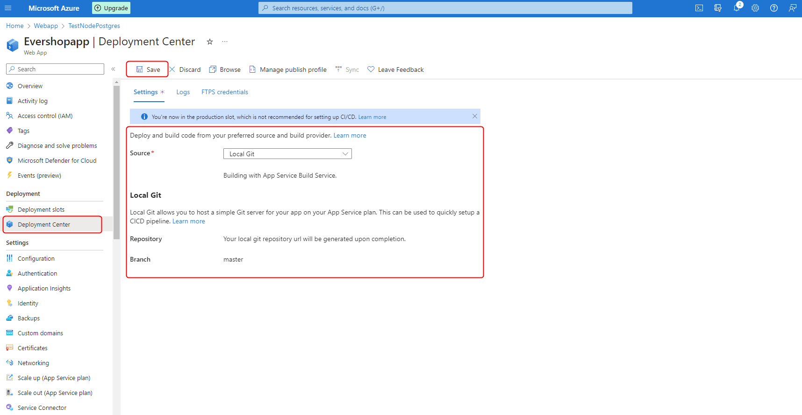
</p>

## Step 3: Add Git Remote To Your Local Project

After saving the deployment configuration, Azure will generate a Git URL for you. You can find the Git URL in the "Deployment Center" page.

<p align="center">

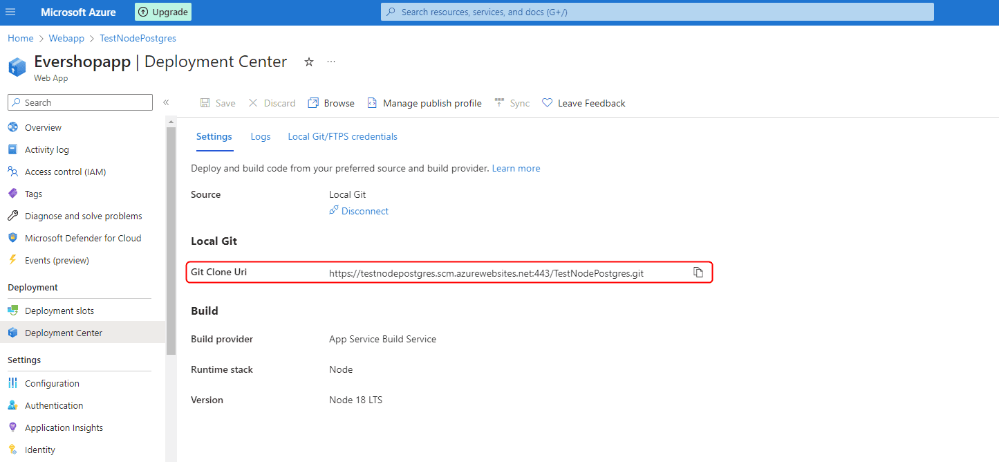
</p>

Now, let's add the Git remote to your local project.

```bash
git remote add azure <your-git-url>
```

:::caution
If your local project is not in a Git repository, you need to initialize a Git repository first by running the following command:

```bash
git init
```
:::

## Step 4: Configure Your Local Project

### Configure Your Npm Scripts
During the deployment process, Azure will run the `npm install` command to install the dependencies and then run the `npm run build` command to build the project. Let's configure the `package.json` file to make sure that Azure can run these commands.

```json title="package.json"
{
  "name": "evershop",
  "version": "1.0.0",
  "description": "",
  "main": "index.js",
  "scripts": {
    "build": "evershop build --skip-minify", // Skip the minification process, if you want to minify the code, remove the --skip-minify flag
    "start": "evershop start",
    "user:create": "evershop user:create",
    "user:changePassword": "evershop user:changePassword"
  },
  "workspaces": [
    "extensions/*"
  ],
  "author": "EverShop",
  "license": "ISC",
  "dependencies": {
    "@evershop/evershop": "^1.0.0-rc.8"
  }
}
```

### Add PM2 Configuration File

Azure uses PM2 to run the Node.js application by default. What we need to do is to add a PM2 configuration file to the root folder of the project. Let's go ahead and create a `ecosystem.config.js` file with the following content:


```json title="ecosystem.config.js"
module.exports = {
  apps: [
    {
      name: "evershopAzure",
      script: "npm",
      env: {
        NODE_ENV: "production",
      },
      args: "run start",
    },
  ],
};
```

### Adding The Git Ignore File

You local project will look like this:

```bash
├── .evershop
├── .log
├── extensions
├── media
├── themes
├── node_modules
├── public
├── .env
├── ecosystem.config.js
├── package.json
├── package-lock.json
└── README.md
```

We will need to add a `.gitignore` file to the root folder of the project. This file will tell Git to ignore some files/folders when we push the code to the Azure remote.

```bash title=".gitignore"
.evershop
.log
node_modules
.env
```

## Step 5: Configure Environment Variables

EverShop will get the database connection information from the environment variables. So we need to configure the environment variables in the Azure portal.

1. Go to the "Configuration" page in the Azure portal.

<p align="center">

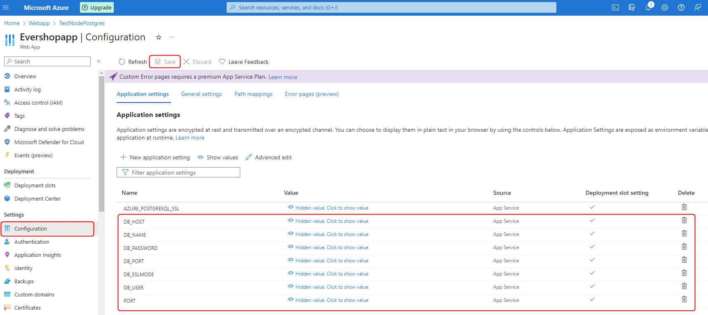
</p>

2. Add/Update the following environment variables:

By default, Azure already has some environment variables for the database connection. We need to update the name of these variables to match our database connection information.

Here is the list of environment variables that we need to update the name:
- `AZURE_POSTGRESQL_DBNAME` => `DB_NAME`
- `AZURE_POSTGRESQL_USERNAME` => `DB_USER`
- `AZURE_POSTGRESQL_PASSWORD` => `DB_PASSWORD`
- `AZURE_POSTGRESQL_HOST` => `DB_HOST`
- `AZURE_POSTGRESQL_PORT` => `DB_PORT`

We also need to add 2 more environment variables:

- `DB_SSLMODE`: Set the value to `require`.
- `PORT`: Set the value to 3000. This is the port that EverShop will use to start the server.

<p align="center">

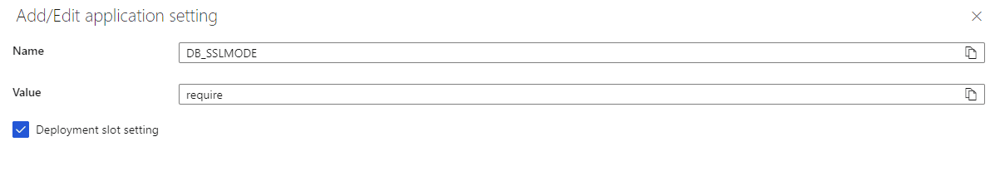
</p>

<p align="center">

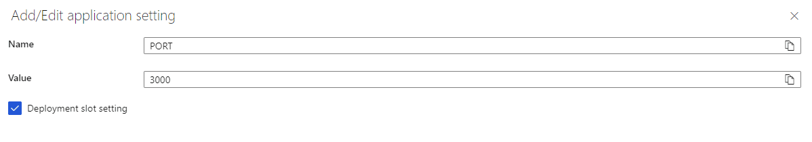
</p>

## Step 6: Deploy Your Project

We almost finish the configuration. Now, let's deploy the project to Azure.

To trigger the deployment process, we need to push the code to the Azure remote.

```bash
git push azure master
```

:::caution
On the first deployment, Azure will ask you for the Git credentials. You can find the Git credentials in the "Deployment Center" page.

<p align="center">

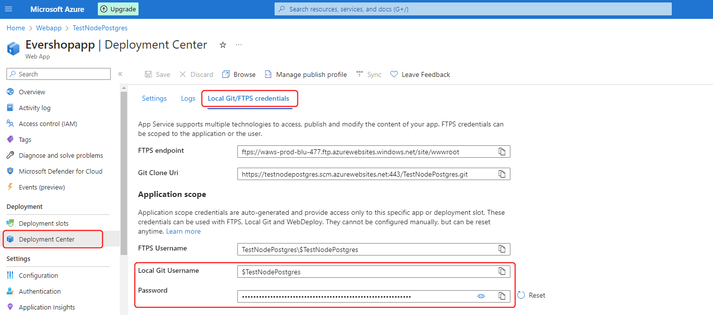
</p>
:::

This step will take a few minutes to complete. Once the deployment is completed, you can access your site at the URL that Azure provides.

<p align="center">

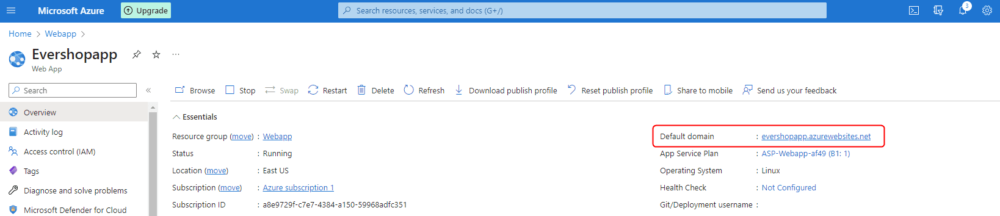
</p>


## Step 7: Create An Admin User

Now, let's create an admin user for your store.

Back to the npm scripts section, you can see that we have a `user:create` script. Let's run this script to create an admin user.

In the Azure portal, click `SSH` to terminal into the server.

<p align="center">

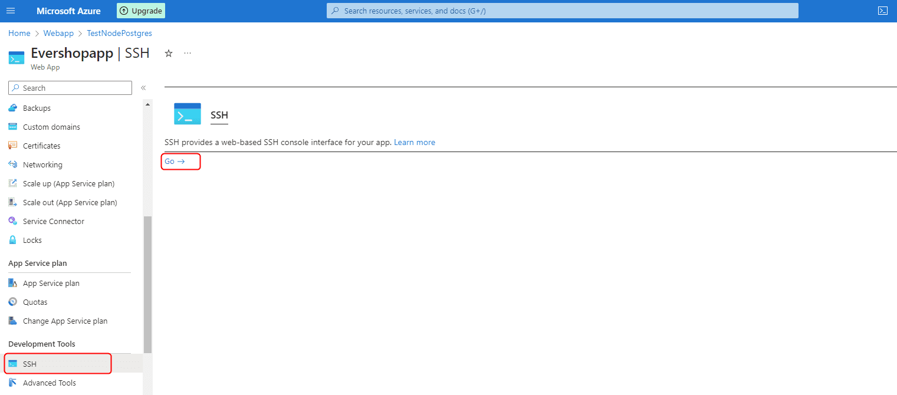
</p>

Normally, our project is located in the `/home/site/wwwroot` folder. Let's go to this folder and run the `user:create` script.

```bash
cd /home/site/wwwroot
npm run user:create -- --email "user email" --password "user password" --name "user name"
```

Now you can access the admin panel at `https://<your-domain>/admin` and log in with the admin user that you just created.

## Step 8: Configure Custom Domain

By default, Azure will assign a domain to your web app. If you want to use your own domain, you can follow the [this document from Azure](https://learn.microsoft.com/en-us/azure/app-service/app-service-web-tutorial-custom-domain)