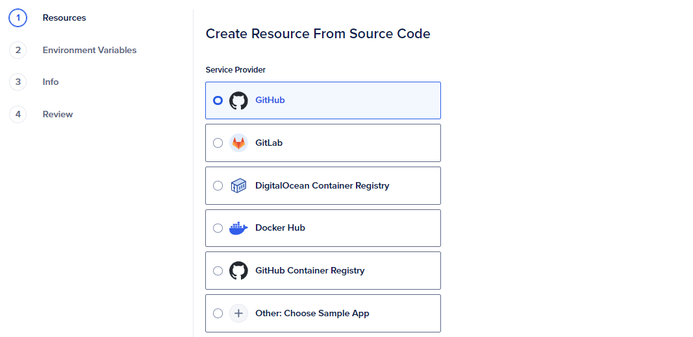
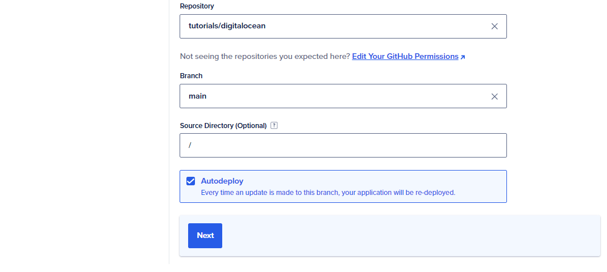
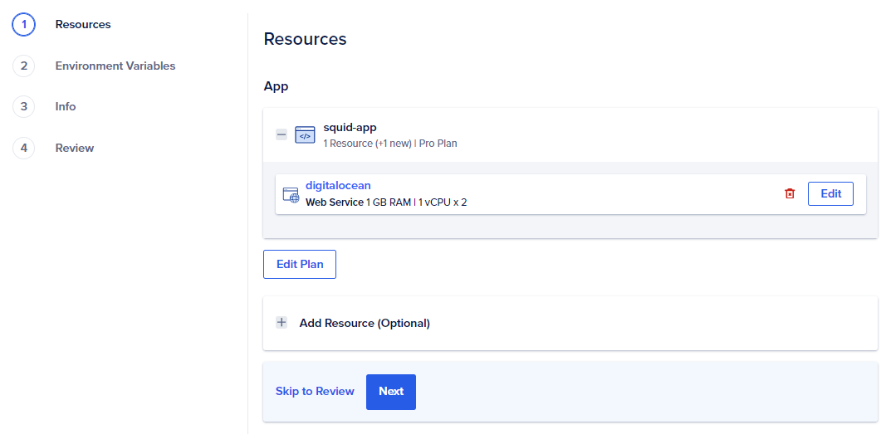
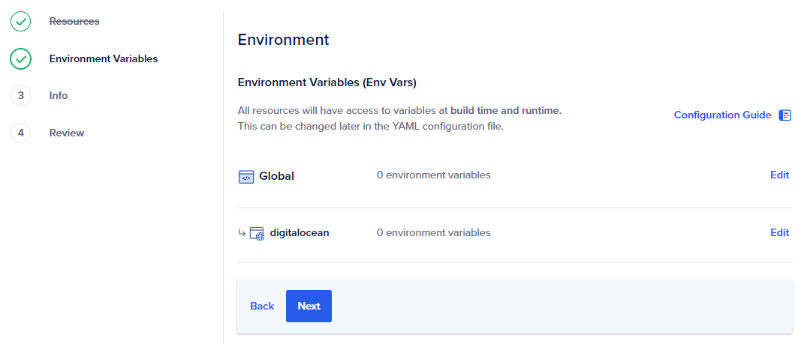
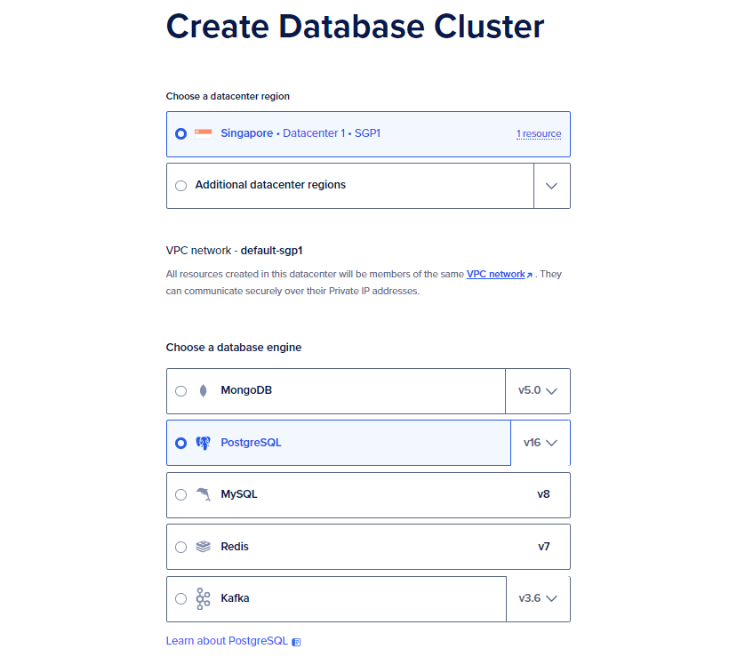
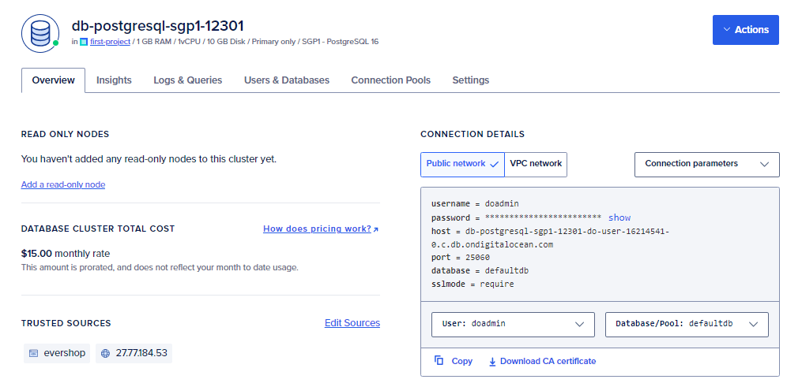
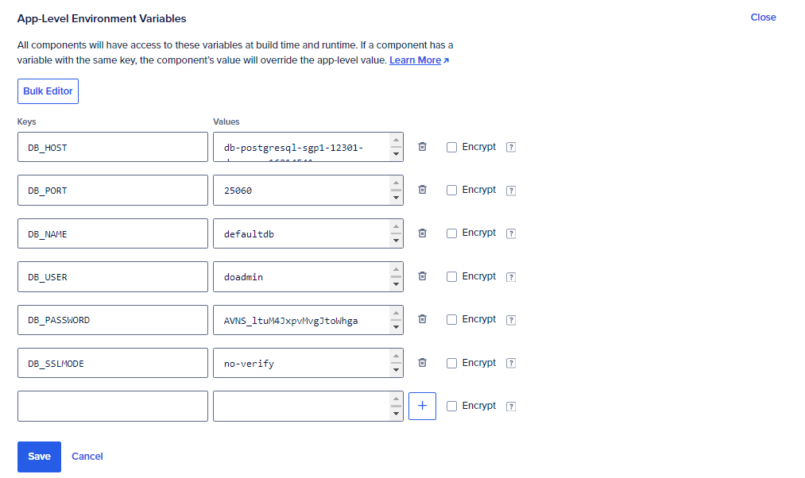
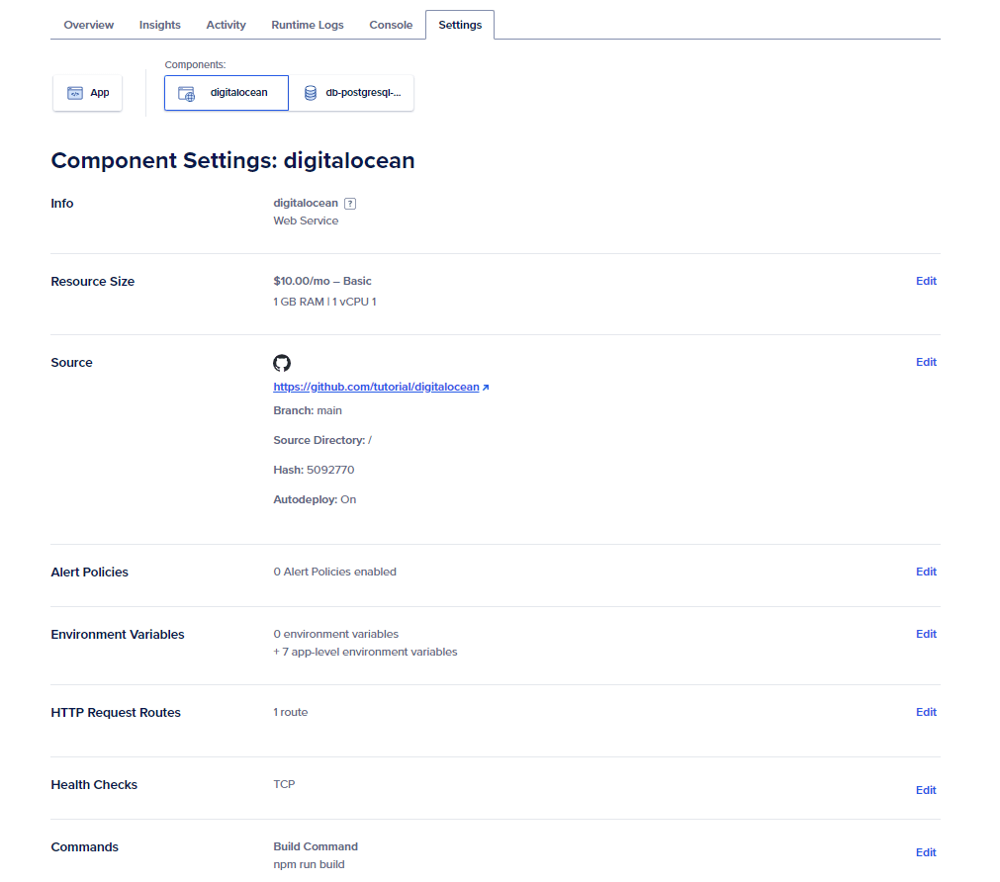
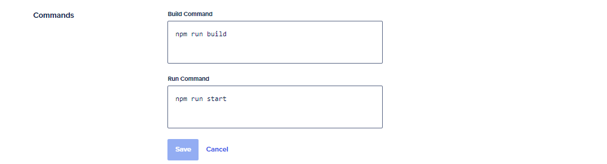

# Deploy EverShop To Digitalocean - App Platforms

This document gives a step by step explanation on how to deploy EverShop to Digitalocean using Digitalocean App Platforms. 

## Prerequisites

Before you start deploying EverShop to Digitalocean, you need to have the following:
- A Digitalocean account.
- A domain name.
- A GitHub account.
- A GitHub repository with the EverShop source code.

## Get started

### Preprare a GitHub repository with the EverShop source code

Although Digitalocean App Platforms supports several deployment methods, in this tutorial, we will use the GitHub repository as the deployment method. First, you need to have a GitHub repository with the EverShop source code. You will be asked to connect your GitHub account to Digitalocean during the deployment process.

During the deployment process, Digitalocean will execute the installation command to install the dependencies and build, then start the application. We need to make sure the following commands are available in the `package.json` file:

```json
"scripts": {
    "build": "evershop build --skip-minify",
    "start": "evershop start",
    "user:create": "evershop user:create",
    "user:changePassword": "evershop user:changePassword"
  }
```

### Create a new Digitalocean App

Login to your Digitalocean account and navigate to the App Platform dashboard. Click on the "Create App" button to create a new app.

<p align="center">

  
</p>

In the "Resources" section, select the GitHub repository that contains the EverShop source code. You can click on the "Manage Access" button to grant Digitalocean access to your GitHub repository.

After you have selected the GitHub repository, you need to configure the deployment settings. You can use the default settings or customize them according to your needs.

<p align="center">

  
</p>

Click "Next" button to continue to the plan review. In this tutorial, we will use the "Basic" plan. You can choose the plan that suits your needs.

<p align="center">

  
</p>

:::warning
Do not add a database to your app here. The reason is that EverShop requires a PostgreSQL database 13+ while Digitalocean App Platforms only supports PostgreSQL 12. We will create a separate database later in this tutorial.
:::

Let's move to the "Environment Variables" section. You can just leave it empty for now. We will add the environment variables later in this tutorial.

<p align="center">

  
</p>

That's it! You can just go ahead to the "Info" and "Review" sections and finish the app creation process.

## Create a PostgreSQL database

EverShop requires a PostgreSQL database 13+. In this tutorial, we will create a PostgreSQL database using Digitalocean Managed Databases.
Just click the "Databases" from the navigation menu and then click the "Create Database" button. This step is quite straightforward. You can choose the PostgreSQL version, the region, and the plan that suits your needs.

<p align="center">

  
</p>

After you have created the database, you can find the connection details in the "Overview" section of your database. You will need these details to connect your EverShop application to the database later in this tutorial.

<p align="center">

  
</p>

:::warning
We need to use the "Public Network" connection method to connect the EverShop application to the database. This is because Digitalocean App Platforms does not support the "VPC Network" connection method.
:::

## Configure the EverShop application

### Configure the environment variables for the EverShop application

Now let's go back to the Digitalocean App Platform dashboard and configure the environment variables for the EverShop application.

Open your app and navigate to the "Settings" tab. Find the "App-level environment variables" section and add the following environment variables:

<p align="center">

  
</p>

- `DB_HOST`: The hostname of your PostgreSQL database.
- `DB_PORT`: The port of your PostgreSQL database.
- `DB_NAME`: The name of your PostgreSQL database.
- `DB_USER`: The username of your PostgreSQL database.
- `DB_PASSWORD`: The password of your PostgreSQL database.
- `DB_SSLMODE`: Set the value to `no-verify`.

### Configure the deployment commands
Still in the "Settings" tab, select the app component and navigate to the "Commands" section. 

<p align="center">

  
</p>

Here you can add the following commands:

<p align="center">

  
</p>


That's it! Digitalocean App Platforms will triggers deploy your EverShop application every time you push the code to the GitHub repository or update the environment variables. And after this step, your EverShop application should be up and running on Digitalocean App Platforms.

<p align="center">

  
</p>

## Create an admin user

Now, let's create an admin user for your store.

From your app dashboard, navigate to the "Console" tab. You can run the following command to create an admin user:

```bash
npm run user:create -- --email "<Email>" --name "<User Name>" --password "Mypassword@123"
```

Now, you can access the admin panel by visiting the `<Your App Domain>/admin` and log in using the credentials you just created.

That's it! You have successfully deployed EverShop to Digitalocean App Platforms. From now on, you can deploy the application by pushing the changes to the GitHub repository.

You can also configure the custom domain, SSL certificate, and other settings from the Digitalocean App Platform dashboard.
