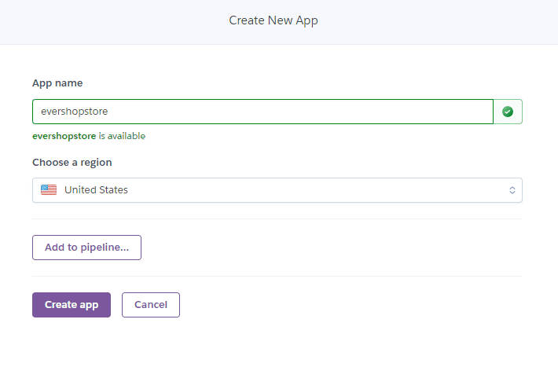
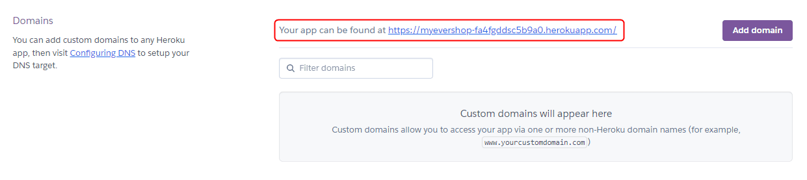

import CodeBlock from '@theme/CodeBlock'
import { nodeVersionSupport, npmVersionSupport } from '../../_const.md';

# Deploy EverShop To Heroku

The purpose of this guide is to allow users to deploy EverShop applications on Heroku. This guide uses the Heroku CLI tool with a PostgreSQL database provided by Heroku.

## Prerequisites

1. An active Heroku account.
2. An EverShop project installed on your local machine.
3. Git installed (for version control if your app is in a Git repository).

## Step 1: Create a New Heroku App

1. Log in to the Heroku dashboard (https://dashboard.heroku.com).
2. Click on the "New" button and select "Create new app" from the dropdown menu.
3. Fill out the necessary information, including the app name, region, and other settings.

<p align="center">

  
</p>


## Step 2: Install Heroku CLI

1. Download and install the Heroku CLI tool from [heroku](https://devcenter.heroku.com/articles/heroku-cli).
2. Open a terminal and run the following command to log in to Heroku:

```bash
heroku login
```

## Step 3: Create a New Heroku Postgres Database

EverShop requires Postgres database. Let's use the Heroku CLI and create a new Heroku Postgres database:

```bash
heroku addons:create heroku-postgresql:PLAN_NAME -a APP_NAME
```

:::caution
Replace `PLAN_NAME` with the plan name you want to use. Check [this page](https://devcenter.heroku.com/articles/heroku-postgres-plans) for more information about the available plans.

Replace `APP_NAME` with the name of your Heroku app.
:::

The database credentials are stored as a `string` with the config variable name `DATABASE_URL`. The database credentials can be retrieved using the following command in the terminal:

```bash
heroku config -a APP_NAME
```

:::caution
Replace `APP_NAME` with the name of your Heroku app.
:::

The output should look like this:

```bash
DATABASE_URL: postgres://gqdnxqkaxcrbyd:dd3aecf3715167ce8a519c518f637sdfcb9ebb0dda3723d050e8a3b8a7cf19fc789@ec2-52-205-11-146.compute-1.amazonaws.com:5432/d468v1qsdfnb0arsqf
```

EverShop does not support the `DATABASE_URL` format. We need to parse the `DATABASE_URL` get the details of the database connection:

For example, the `DATABASE_URL` above can be parsed as follows:

```bash
DB_HOST=ec2-52-205-11-146.compute-1.amazonaws.com
DB_PORT=5432
DB_USER=gqdnxqkaxcrbyd
DB_PASSWORD=dd3aecf3715167ce8a519c518f637sdfcb9ebb0dda3723d050e8a3b8a7cf19fc789
DB_NAME=d468v1qsdfnb0arsqf
DB_SSLMODE=no-verify
```

Now, we need to add these environment variables to the Heroku app. We can do this by running the following command:

```bash
heroku config:set DB_HOST=ec2-52-205-11-146.compute-1.amazonaws.com -a APP_NAME
heroku config:set DB_PORT=5432 -a APP_NAME
heroku config:set DB_USER=gqdnxqkaxcrbyd -a APP_NAME
heroku config:set DB_PASSWORD=dd3aecf3715167ce8a519c518f637sdfcb9ebb0dda3723d050e8a3b8a7cf19fc789 -a APP_NAME
heroku config:set DB_NAME=d468v1qsdfnb0arsqf -a APP_NAME
heroku config:set DB_SSLMODE=no-verify -a APP_NAME
```

:::caution
Replace `APP_NAME` with the name of your Heroku app.
:::

## Step 4: Prepare The Local Project

We assume that you already have an EverShop project installed on your local machine. If not, please follow the [installation guide](/docs/development/getting-started/installation-guide) to install EverShop on your local machine.

Typically, the EverShop project structure will look like this:

```bash
├── .evershop # This is where the production build is stored
├── .log
├── extensions # This is where the extensions are stored
├── media # This is where the uploaded images are stored
├── themes # This is where the themes are stored
├── node_modules # This is where the node modules are stored
├── public # This is where the public files are stored
├── .env
├── package.json
├── package-lock.json
└── README.md
```

### Specify The Node.js Version

Evershop requires Node.js version between **{nodeVersionSupport.min}** and **{nodeVersionSupport.max}**.
Heroku will let us specify the Node.js version that we want to use in the `package.json` file. We need to add the following line to the `package.json` file:

<CodeBlock language="json" title="package.json">
{
  `{
    "engines": {
      "node": "${nodeVersionSupport.min.split('.')[0]}.x"
    }
  }`
}
</CodeBlock>

### Specify The NPM Version

EverShop requires NPM version **{npmVersionSupport.min}+**. We need to add the following line to the `package.json` file:

<CodeBlock language="json" title="package.json">
{
  `{
    "engines": {
      "npm": "${npmVersionSupport.min}.x"
    }
  }`
}
</CodeBlock>

### Specify The Start Script

Heroku will run the `npm start` command to start the application. We need to add the following line to the `package.json` file:

```json title="package.json"
{
  "scripts": {
    "start": "evershop start"
  }
}
```

### Configure The Build Behavior

During the deployment process, Heroku will install both `dependencies` and `devDependencies`. If you want to skip the installation of `devDependencies`, you can tell Heroku to do so by using the following command:

```bash title="Heroku CLI"
heroku config:set NPM_CONFIG_PRODUCTION=true -a APP_NAME
```

In this tutorial, we want to use `npm install` instead of `npm ci`. Let's use the Heroku CLI to tell Heroku to use npm to install the dependencies:

```bash title="Heroku CLI"
heroku config:set USE_NPM_INSTALL=true -a APP_NAME
```

:::info
By default, Heroku set the `NODE_ENV` environment variable to `production`.
:::

Now, let's add a `build` command to the `package.json` file so that Heroku can build the application before running it:

```json title="package.json"
{
  "scripts": {
    "build": "evershop build --skip-minify", // Skip the minification process, if you want to minify the code, remove the --skip-minify flag
    "start": "evershop start"
  }
}
```

### Adding Scripts To Create Users

After the application is deployed the first time, we need to create a user to access the admin panel. Let's add a script to the `package.json` file:

```json title="package.json"
{
  "scripts": {
    "build": "evershop build --skip-minify", // Skip the minification process, if you want to minify the code, remove the --skip-minify flag
    "start": "evershop start",
    "user:create": "evershop user:create",
  }
}
```

### Adding The Git Ignore File

Let's go ahead and create a `.gitignore` file with the following content:

```bash title=".gitignore"
.evershop
.log
node_modules
.env
```

## Step 5: Deploy The Application

### Initialize A Git Repository

If your project is not in a Git repository, you need to initialize a Git repository:

```bash
git init
```

### Commit The Changes

Let's commit the changes:

```bash
git add .
git commit -m "Initial commit"
```

### Add The Heroku Remote To The Local Git Repository

Let's add the Heroku remote to the local Git repository:

```bash
heroku git:remote -a APP_NAME
```

:::caution
Replace `APP_NAME` with the name of your Heroku app.
:::

### Push The Changes To Heroku

Let's push the changes to Heroku:

```bash
git push heroku main
```

This will trigger the deployment process. Once the deployment process is completed, you can access the application by visiting the URL of your Heroku app.

<p align="center">

  
</p>

## Step 6: Create A User

If this is the first time you deploy the application, you need to create a user to access the admin panel. Let's run the following command using the Heroku CLI:

```bash
heroku run npm run user:create -- -- --email "<Email>" --name "<User Name>" --password "Mypassword@123" -a myevershop
```

Now, you can access the admin panel by visiting the `<Your Heroku Domain>/admin` and log in using the credentials you just created.


That's it! You have successfully deployed EverShop to Heroku. From now on, you can deploy the application by pushing the changes to the Heroku remote.