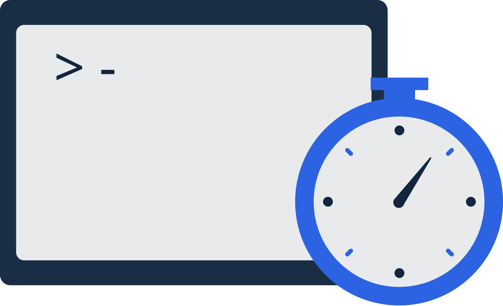

## Overview

In this document, we will learn about the cron job system in EverShop. EverShop provides a powerful cron job system that allows you to schedule tasks to run at specific intervals. You can use cron jobs to automate repetitive tasks, such as sending emails, updating data, and more.

## How to Create a Cron Job in EverShop

In this section, we assume that you have an extension that installed in your EverShop store. If you don't have an extension, or you want to learn how to create your own extension, please refer to [this document](/docs/development/module/module-overview.md).

### Step 1: Create a New Cron Job

From your extension folder, create a new sub-folder called `jobs`. Inside the `jobs` folder, create a new `js` file for your cron job. For example, let's create a file called `myCronJob.js`:

```bash
├── your-extension
│   ├── jobs
│   │   ├── myCronJob.js
```

The file `myCronJob.js` should export a function that will be executed when the cron job runs. Here is an example of a simple cron job that logs a message to the console:

```js title="myCronJob.js"

export default function myCronJob() {
    console.log('Hello, this is my cron job!');
}
```

The cron function can be synchronous or asynchronous.

### Step 2: Register the Cron Job

Use the [json configuration](/docs/development/knowledge-base/configuration-guide.md) file to register your cron job. Add the following configuration to your `config.json` file:

```json title="config.json"
{
    "system": {
        "jobs": [
            {
                "name": "myCronJob",
                "resolve": "<your extension>/jobs/myCronJob.js", // This path must be resolveable, Evershop will import the module for you
                "schedule": "0 0 * * *",
                "enabled": true // Set to false to disable the cron job
            }
        ]
    }
}
```

In the configuration above, we define a new cron job called `myCronJob`. The `resolve` property should point to the path of the cron job file. The `schedule` property defines the schedule for the cron job. In this example, the cron job will run every day at midnight. The `enabled` property can be set to `true` or `false` to enable or disable the cron job.

### Step 3: Run the Cron Job

Once you have registered the cron job, EverShop will automatically run the cron job at the specified schedule. You can view the logs for the cron job in the EverShop admin panel.

:::warning
The cron job will run in the main thread of the application. Make sure your cron job is optimized and does not block the main thread.
We strongly recommend using asynchronous code in your cron job and carefully scheduling the cron job to avoid performance issues.
:::

## Cron Job Schedule

The `schedule` property in the cron job configuration defines the schedule for the cron job. The schedule is defined using a cron expression. A cron expression is a string that represents a set of times, using 5 space-separated fields:

- Minute (0 - 59)
- Hour (0 - 23)
- Day of the month (1 - 31)
- Month (1 - 12)
- Day of the week (0 - 7) (0 and 7 both represent Sunday)
