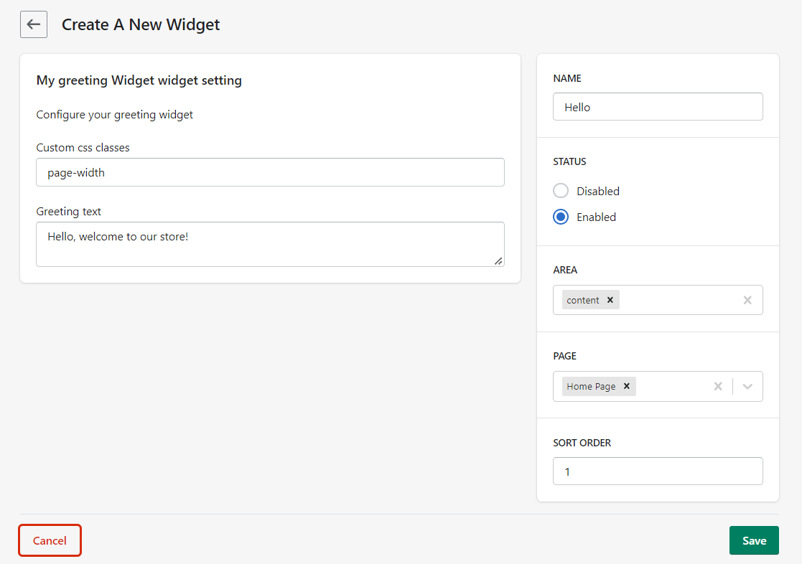

## What is a Widget?

<p align="center">

  
</p>

Widgets are small blocks that can be embedded in a store front. They are used to display information or provide functionality to users. Widgets can be used to display a wide range of content, such as a product listings, a banner or a block of text. They can also be used to provide functionality, such as a search box or a shopping cart.

In EverShop, widgets are used to display content on the front-end of the website. They are used to display product listings, banners, blocks of text, and other content. Admin user can create and manage widgets from the admin panel and display them on the front-end of the website.

## Why developing a Widget?

Widgets are a powerful tool for displaying content on the front-end of a website. They offer a flexible and customizable way to display content, and can be used to create a wide range of layouts and designs for the store.
Widgets help the store owner to create a unique and engaging shopping experience for customers.

## How to develop a Widget?

:::info
Before you start developing a widget, we recommend reading [EverShop’s module overview documentation](./module-overview) and [Create your first module documentation](./create-your-first-extension) to understand the module structure and how to create a module.
:::

This document will guide you through the process of developing a widget for EverShop.

Let's assume that you have already installed EverShop and you have a running project. If you haven't installed EverShop yet, please check [this document](../getting-started/installation-guide) for the installation guide.

Let's start!

### Step 1: Create an extension

The first step in developing a widget is to create an extension. Let's call our extension `greeting_widget`. Our extension structure will look like this:

```bash
extensions/
└── greeting_widget/
    ├── bootstrap.js
    ├── components/
    │   └── widget/
    │       ├── GreetingWidgetSetting.jsx
    │       └── GreetingWidget.jsx
    └── package.json
  

```

And this is how the `package.json` file will look like:

```json title="extensions/greeting_widget/package.json"
{
  "name": "greeting_widget",
  "version": "1.0.0",
  "description": "A simple greeting widget for EverShop",
  "keywords": [
    "EverShop widget"
  ],
  "author": "The Nguyen (https://evershop.io/)",
  "license": "GNU GENERAL PUBLIC LICENSE 3.0",
  "engines": {
    "node": ">= 14.0.0"
  }
}
```

### Step 2: Register our widget from the `bootstrap.js` file

From the `bootstrap.js` file, we will register our widget. Here is an example of how to register a widget:

```javascript title="extensions/greeting_widget/bootstrap.js"
const config = require('config');

module.exports = () => {
    // Register our greeting widget
    const greetingWidget = {
        greeting_widget: {
            setting_component:
                'greeting_widget/components/widget/GreetingWidgetSetting.jsx',
            component:
                'greeting_widget/components/widget/GreetingWidget.jsx',
            name: 'My greeting Widget',
            description: 'A simple greeting widget',
            default_settings: {
                
            },
            enabled: true
        }
    };
    config.util.setModuleDefaults('widgets', greetingWidget);
}
```

In the above example, we have registered a widget called `greeting_widget`. Let's break down the properties of the widget object above:

- `setting_component`: The path to the setting component of the widget. This component is used to configure the widget settings. In this example, the setting component is located at `extensions/greeting_widget/components/widget/GreetingWidgetSetting.jsx`.
- `component`: The path to the main component of the widget. This component is used to render the widget on the front-end of the website. In this example, the main component is located at `extensions/greeting_widget/components/widget/GreetingWidget.jsx`.
- `name`: The name of the widget. This is the name that will be displayed in the admin panel when adding a new widget.
- `description`: A description of the widget. This is a brief description of what the widget does.
- `default_settings`: The default settings for the widget if any. These settings will be used when admin user adds a new widget.
- `enabled`: Whether the widget is enabled or not. If set to `false`, the widget will not be available for use.

:::warning
Both `setting_component` and `component` properties must be resolvable paths to the component files. In our example, you must run `npm install greeting_widget` to install our extension. This will tell Node.js to recognize our extension as a module. Please make sure you have configured the folder `extensions` as a workspace.
:::

Ok, we have registered our widget. Let's move to the next step. 

### Step 3: Create the setting component

The setting component is used to configure the widget settings. It is displayed in the admin panel when adding a new widget. Here is an example of how the setting component can look like:

```javascript title="extensions/greeting_widget/components/widget/GreetingWidgetSetting.jsx"
import React from 'react';
import PropTypes from 'prop-types';
import { Field } from '@components/common/form/Field';

export default function GreetingWidgetSetting({
  greetingWidget: { text, className }
}) {
  return (
    <div>
        <p>Configure your greeting widget</p>
        <Field
            type="text"
            name="settings[className]"
            label="Custom css classes"
            value={className}
            placeholder="Custom css classes"
        />
        <Field
            type="textarea"
            name="settings[text]"
            label="Greeting text"
            value={text}
        />
    </div>
  );
}

GreetingWidgetSetting.propTypes = {
  greetingWidget: PropTypes.shape({
    text: PropTypes.string,
    className: PropTypes.string
  })
};

GreetingWidgetSetting.defaultProps = {
  greetingWidget: {
    text: 'Hello, welcome to our store!',
    className: ''
  }
};

export const query = `
  query Query($settings: JSON) {
    greetingWidget(settings: $settings) {
      text
      className
    }
  }
`;

export const variables = `{
  settings: getWidgetSetting()
}`;
```

In the above example, we have created a simple setting component for our greeting widget. There are few things to explain here:

- We do not need to handle the form submission in the setting component. The form submission is handled by the EverShop admin panel.

- We use graphql query to fetch the widget settings. In above example, we query the `greetingWidget` settings. So we need to define the query and variables for the graphql query. This will be covered in the next step.

- There is a special function `getWidgetSetting()` in the above example. This function is used to get the settings of the widget. EverShop will automatically inject the widget instance settings into the query for you.

### Step 4: Define the graphql query

As mentioned in the previous step, we need to define the graphql query to fetch the widget settings. Let's navigate to the extension folder and define our graphql types for our Greeting widget:

```bash
extensions/
└── greeting_widget/
    ├── graphql/
    │   └── types/
    │       └── GreetingWidget
    │           ├── GreetingWidget.graphql
    │           └── GreetingWidget.resolvers.js
```

:::info
You can learn more about graphql in EverShop here [EverShop’s graphql documentation](../knowledge-base/graphql).
:::

Let's define our graphql types for the Greeting widget:

```graphql title="extensions/greeting_widget/graphql/types/GreetingWidget/GreetingWidget.graphql"
"""
Return a text Widget
"""
type GreetingWidget {
  text: String
  className: String
}

extend type Query {
  greetingWidget(settings: JSON): GreetingWidget
}
```

And the resolver for the Greeting widget:

```javascript title="extensions/greeting_widget/graphql/types/GreetingWidget/GreetingWidget.resolvers.js"

module.exports = {
  Query: {
    greetingWidget(_, { settings }) {
      return { text: settings.text, className: settings.className };
    }
  }
};
```

In the above example, we have defined a graphql type `GreetingWidget` with two fields `text` and `className`. We have also defined a query `greetingWidget` to fetch the widget settings.

### Step 5: Create the main component

The main component is used to render the widget on the front-end of the website. Here is an example of how the main component can look like:

```javascript title="extensions/greeting_widget/components/widget/GreetingWidget.jsx"
import React from 'react';
import PropTypes from 'prop-types';

export default function GreetingWidget({ greetingWidget: { text, className }}) {
  return (
    <div className={className}>
      <h1>{text}</h1>
    </div>
  );
}

GreetingWidget.propTypes = {
  text: PropTypes.string,
  className: PropTypes.string
};

GreetingWidget.defaultProps = {
  text: '',
  className: ''
};

export const query = `
  query Query($settings: JSON) {
    greetingWidget(settings: $settings) {
      text
      className
    }
  }
`;

export const variables = `{
  settings: getWidgetSetting()
}`;
```

In the above example, we have created a simple main component for our greeting widget. The component will render a heading with the greeting text to the front-end of the website.

### Step 6: Enable our extension

To enable our extension, we need to add the following lines to the configuration file in your EverShop project:

```javascript title="./config/production.json"
{
    ...,
    "system": {
        "extensions": [
            {
                "name": "greeting_widget",
                "resolve": "extensions/greeting_widget",
                "enabled": true,
                "priority": 20 
            }
        ]
    }
}
```

### Step 7: Build your project

After enabling the extension, you need to build your project again to apply the changes. Run the following command to build your project:

```bash
npm run build
```

That's it! You have successfully developed a widget for EverShop. You can now create a new widget from the admin panel and display it on the front-end of the website. It will look like this:

*The widget setting:*

<p align="center">

  
</p>

*The widget on the front-end:*

<p align="center">

  
</p>

## How to override a widget component?

You can override a widget component by changing the widget configuration. Let's say you want to override the `GreetingWidget` component for applying custom styles. You can do this by changing the widget configuration from your configuration file. Here is an example of how to override the `GreetingWidget` component:

```javascript title="./config/production.json"
{
    ...,
    "system": {
        "widgets": {
            greeting_widget: {
                component: 'extensions/my_custom_greeting_widget/components/widget/MyCustomGreetingWidget.jsx'
            }
        }
    }
}
```

In the above example, we have overridden the `GreetingWidget` component with `MyCustomGreetingWidget` component. Now, the `MyCustomGreetingWidget` component will be used to render the widget on the front-end of the website.

:::info
You will need to build your project again after changing the widget configuration.
:::

## Conclusion

In this document, we have learned how to develop a widget for EverShop. We have covered the steps to create an extension, register a widget, create the setting component, define the graphql query, create the main component, enable the extension, and build the project. We have also learned how to override a widget component. You can now create custom widgets for your EverShop project and provide a unique shopping experience for your customers.